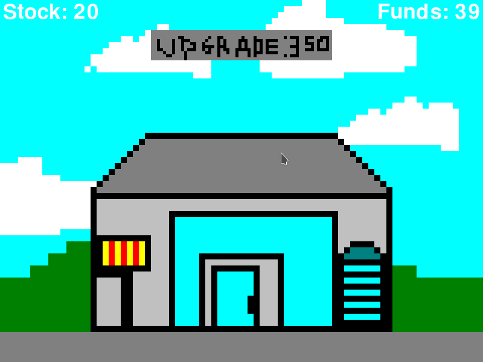

# Nuofdl Shop Clicker (C++ - SDL)
Click as fast as you can on the factory. Each click will add stock. \
The business will earn money while there is stock. Upgrading will \
increase stock usage, money earned and stock per click.

# Build
To build the shop-clicker binary you will need all required build tools needed to compile via Makefile and g++. You will also need SDL2 with image, ttf and mixer both the libraries and headerfiles. This was created in linux where the SDL2 headerfiles are in the SDL2 folder. In windows i believe the "SDL2/" may need to be removed.

ArchLinux instructions.

    sudo pacman -S --needed base-devel
    sudo pacman -S --needed sdl2 sdl2_image sdl2_mixer sdl2_ttf
    make
    ./shop-clicker
 
# Controls
Click Building: Add stock \
Click Upgrade: Upgrades to next tier \
Escape: Quit \
Space: Play Reset.

# Screenshot

