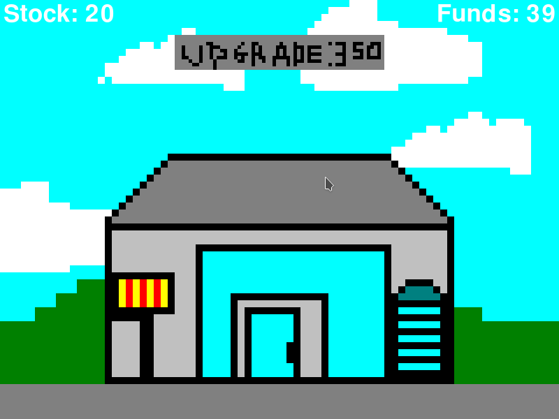

# Nuofdl Shop Clicker
Click as fast as you can on the factory. Each click will add stock. \
The business will earn money while there is stock. Upgrading will \
increase stock usage, money earned and stock per click.

# Windows 32bit/64bit
There is a stand alone .exe file for both 32 and 64bit windows just click on it.

# Linux / OSX / Windows
You will need to make sure Love2D is installed. Then just click the .love file.

ArchLinux instructions.

    sudo pacman -S --needed love
    love .

# Controls
Click Building: Add stock \
Click Upgrade: Upgrades to next tier \
Escape: Quit \
Space: Play Reset.

# Screenshot

